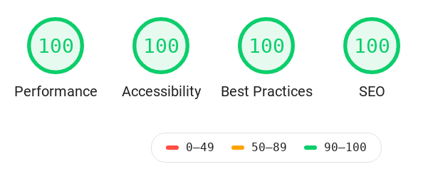

Keep It Simple CSS
==================

## Overview
Kiscss (pronounced as 'kisses') is yet another CSS library designed to
be minimal and out of your way when you want to focus on functionality.

> Keep it simple. Focus on functionality. Visual design and scale
> come after an idea comes to life, not before.



## Why did we create this?
At our search lab, we spin through testing ideas that have a half-life
of less than two weeks most of the time. To get to a functional and
usable state before the idea decays, we needed a CSS library that let
the idea come to life without suffering from undue cognitive load to
get something displayed on the screen that is decent to look at. Such
a library should not restrict or dictate our choices in visual design
down the road.

Our goal is to be able to get to a testable product fast without losing
the ability to improve on the visual aesthetics later. We think using
large and complex CSS libraries during conception stage is not the right
choice for building MVPs.

Furthermore, any component that is lacking in kiscss is better created
using CSS flex and grid, and modern CSS modules approach. We think
this provides for a more robust roadmap for the MVP.

In summary, we needed a library:
- that is less than 10KB gzipped
- that scores 100% in lighthouse in all major metrics
- that has its code organized to support git subtree based integration
- that doesn't force css experts to also become experts in the next new fangled
  javascript framework
- that integrates well at the source level using bundlers such as webpack
- that is minimal and fits well with React, Vue, ... ecosystems
- that lets us stay close to semantic HTML and not spew shit
  ton of div elements to achieve cool look and feel effects
- that any one with **good** SCSS/CSS knowledge can comprehend in less
  than a couple of hours (by looking at the test code).

We created kiscss to fit those needs. We took inspiration from the following
css libraries and references (on how to AND how not to) in creating kis.css:
### Libraries
- normalize.css
- picnic.css
- balloon.css
- HiQ. A high-IQ CSS
- Bulma

>
> Had we come across Bulma earlier on chances are that this library may not
> exist. Still, at less than 6KB gzipped with most of what we need, we do
> intend to love and care for it as we find repeating patterns in prototyping
> high fidelity functional screens.
>
> Some day it may grow into bulma or may be not ;-)
>

### References
- http://oxygencss.com/book/02-oxygen-naming-conventions.html
- https://inclusive-components.design/
- https://rocssti.net/en/code-css-source-rocssti
- https://material.io/design/
- https://material.io/develop/web/components/typography/
- https://learnui.design/blog/mobile-desktop-website-font-size-guidelines.html

## Bugs in dependencies
- [ ] [Preload hack for css breaks html-inline-css-plugin](https://github.com/Runjuu/html-inline-css-webpack-plugin/issues/10)

## Features
- [x] Designed to make semantic html look good without classes
- [x] Mobile first css

## Development
> If using [Yarn](https://yarnpkg.com/), `yarn` can replace all occurences
> of `npm` in the command line below. :ok_hand:

If live-server is not installed globally do so now.
```
# is live-server installed ?
$ which `live-server`

# if not installed, install it now
$ npm install --global live-server
```

### Tasks
|  task   | command line          | notes                                         |
|:--------|:----------------------|:----------------------------------------------|
| install |```npm install```      | installs dependencies                         |
| lint    |```npm run lint```     | run eslint on `src` folder                    |
| lint:fix|```npm run lint fix``` | run eslint on `src` folder                    |
| test    |```npm run test```     | simple render test                            |
| build   |```npm run build```    | compile to `build` folder                     |
| start   |```npm run start```    | web serve `build` folder                      |
| watch   |```npm run watch```    | watch/build changes to `app` and `web` folders|

## Integrating kiscss in your application
One of the design goals for kiscss is to support a "make it yours" approach
to integration. Each MVP we build choses a released version of kiscss and
adds a subtree of src/lib/kiscss to its baseline. From then on the intent
is for this version of kiscss to evolve freely with the prototype, with no
constraints on either having to push back or pull updates to kiscss.

The MVP can always point to a newer released version of kiscss if it choses
to. This is akin to adding npm packages by using git urls. This method provides
more explicit control of the process and integrates well with your bundler and
gives more oportunities for optimization.


### Using git subtree
TBD

## TODO
- [ ] Documentation (WIP, in the meantime take a look at the demo app)
- [ ] Write instructions on how to use git subtree for integration
- [ ] Enhance core/* to make webby apps look better out of the box
- [ ] Semver based release management
- [ ] Iterate on mobile first css (as bugs get reported)

## Credits and attribution
- [normalize.css](http://nicolasgallagher.com/about-normalize-css/)
- ```kitchen-sink.html``` came from [HiQ](https://github.com/jonathanharrell/hiq)
- Most of the content for the test home page came from [PicnicCss](https://github.com/franciscop/picnic)
- Inspiration and alignment to principles of simplicity came from HiQ and PicnicCSS
- Baseline scss code for kiscss came from PicnicCss which is under MIT License
- Tooltip code adopted from [balloon.css](https://kazzkiq.github.io/balloon.css/)
- Tabs code adopted from [mikestreety](https://codepen.io/mikestreety/pen/yVNNNm)
- Nav code adopted from [mutedblues](https://codepen.io/mutedblues/pen/MmPNPG)

## Alternatives
You have choices. Turns out we are not alone in our thinking. Search for
'lightweight' and 'classless' css libraries in the [awesome css frameworks list](https://github.com/troxler/awesome-css-frameworks/blob/master/readme.md) maintained by [Troxler?](https://github.com/troxler).

## License
MIT